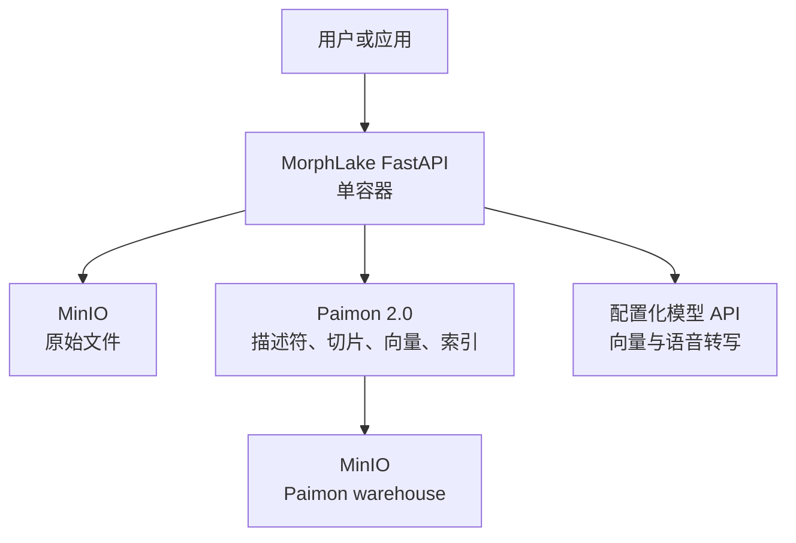

# MorphLake

MorphLake 是一个以 **Apache Paimon 2.0 + MinIO** 为核心的多模态数据底座。它用一个
Python/FastAPI 容器提供上传、清单查询、全文检索、向量检索和下载接口，不引入 Spark、
Milvus、Elasticsearch，也不依赖常驻 Flink 作业。

> 当前状态：可运行的首个版本。生产部署前需要接入实际 MinIO 地址和模型网关，并根据
> 数据量完成压测与备份策略验证。

## 设计目标

- **简单**：服务、写入和索引构建都在一个 Python 容器内完成。
- **稳定**：一个追加型 Paimon 表、同步提交、单进程写锁；不维护常驻计算作业。
- **Descriptor‑Only**：文件二进制只存 MinIO；Paimon 保存对象引用、元数据、文本和向量。
- **原生检索**：全文使用 Paimon `full-text`，向量使用 Paimon `ivf-flat` 全局索引。
- **配置驱动模型**：模型提供方、地址、模型名、维度、超时均在 YAML/环境变量中配置。



## 能力范围

| 能力 | 支持内容 |
| --- | --- |
| 上传 | 文档、图片、音频独立接口；另保留自动分类兼容接口 |
| 必填元数据 | `business_domain`（业务域）、`department`（业务部门） |
| 文档处理 | 文本提取、可配置重叠切片、逐切片向量化 |
| 图片处理 | 文件级图片向量 |
| 音频处理 | 文件级音频向量；可选语音转写和转写文本向量 |
| 清单查询 | 类型、日期、业务域、部门、文件名关键字 |
| 全文检索 | 业务域、日期范围、全文关键字 |
| 向量检索 | 上传文档/图片/音频自动向量化并返回 Paimon Top10；也支持直接提交向量 |
| 下载 | 按 `file_id` 流式下载 MinIO 对象 |

旧式二进制 `.doc` 会返回 415；请先转换为 `.docx`。扫描版 PDF 的 OCR 不在默认链路中，
可通过模型网关扩展。

## 快速开始

### 1. 配置

```bash
cp .env.example .env
```

至少修改以下配置：

```dotenv
MINIO_ENDPOINT=minio.example.internal:9000
MINIO_ACCESS_KEY=replace-me
MINIO_SECRET_KEY=replace-me
MINIO_DATA_BUCKET=morphlake-data
MINIO_PAIMON_BUCKET=morphlake-paimon
PAIMON_WAREHOUSE=s3://morphlake-paimon/warehouse
```

开发配置默认使用确定性的 `hash` 向量，仅用于接口和索引冒烟验证，不具备语义效果。
生产环境应修改 `config/models.yaml`，把对应 `provider` 改为
`openai_compatible`，并设置 `EMBEDDING_API_BASE`、`EMBEDDING_API_KEY` 和模型名称。

### 2. 启动单容器

```bash
docker compose up --build -d
curl http://localhost:8080/health/ready
```

容器启动时会：

1. 检查并创建两个 MinIO bucket（需要账号具有相应权限）；
2. 创建 `morphlake.multimodal_assets` 表；
3. 校验已存在表的字段、分区、`bucket=-1` 和 deletion-vector 设置。

### 3. 上传并查询

```bash
curl -X POST http://localhost:8080/api/v1/files/documents \
  -H 'X-API-Key: replace-if-configured' \
  -F 'business_domain=risk' \
  -F 'department=compliance' \
  -F 'file=@./contract.pdf'
```

用同模态查询文件自动向量化并查询 Top10（查询文件不会入库）：

```bash
curl -X POST http://localhost:8080/api/v1/search/vector/file \
  -H 'X-API-Key: replace-if-configured' \
  -F 'business_domain=risk' \
  -F 'start_date=2026-01-01' \
  -F 'end_date=2026-12-31' \
  -F 'file=@./query.pdf'
```

```bash
curl -G http://localhost:8080/api/v1/files \
  -H 'X-API-Key: replace-if-configured' \
  --data-urlencode 'media_type=document' \
  --data-urlencode 'business_domain=risk' \
  --data-urlencode 'department=compliance' \
  --data-urlencode 'filename=contract' \
  --data-urlencode 'start_date=2026-01-01' \
  --data-urlencode 'end_date=2026-12-31'
```

```bash
curl -X POST http://localhost:8080/api/v1/search/full-text \
  -H 'Content-Type: application/json' \
  -H 'X-API-Key: replace-if-configured' \
  -d '{
    "business_domain": "risk",
    "keyword": "counterparty exposure",
    "start_date": "2026-01-01",
    "end_date": "2026-12-31",
    "limit": 20
  }'
```

向量请求中的维度必须与配置一致（默认文本 384、图片 512、音频 384）：

```bash
python - <<'PY' > /tmp/vector-request.json
import json
print(json.dumps({
    "business_domain": "risk",
    "vector_field": "text",
    "vector": [0.0] * 384,
    "start_date": "2026-01-01",
    "end_date": "2026-12-31",
    "limit": 10,
}))
PY

curl -X POST http://localhost:8080/api/v1/search/vector \
  -H 'Content-Type: application/json' \
  -H 'X-API-Key: replace-if-configured' \
  --data-binary @/tmp/vector-request.json
```

```bash
curl -OJ \
  -H 'X-API-Key: replace-if-configured' \
  http://localhost:8080/api/v1/files/FILE_ID/download
```

完整接口说明见 [docs/api.md](docs/api.md)，表结构见
[docs/table-model.md](docs/table-model.md)，架构和生产注意事项见
[docs/architecture.md](docs/architecture.md)。启动后也可访问 `/docs` 查看 OpenAPI UI。

## 为什么使用 unaware bucket

表按 `business_domain / department / upload_month` 分区，并设置 `bucket=-1`。这是有意选择：
PyPaimon 2.0 的通用全文和向量全局索引要求 unaware bucket，固定桶会被拒绝。分区承担主要
数据裁剪职责；月份分区避免日粒度小文件爆炸，同时业务域和部门提供物理隔离。

通用全局索引同时要求关闭 deletion vectors，因此表采用追加模式。首个版本不提供删除/更新
接口；如后续需要数据撤回，应设计软删除字段和定期重写流程，而不是破坏当前索引约束。

## 开发验证

```bash
python -m venv .venv
. .venv/bin/activate
pip install -e '.[dev]'
ruff format --check .
ruff check .
pytest -q
```

带原生 Paimon 全文和 IVF‑Flat 的集成测试使用本地临时 warehouse，不连接真实 MinIO。
Docker 镜像构建也包含在 GitHub Actions 中。

## 目录

```text
config/                 模型和切片配置
docs/                   架构、表模型、接口文档
src/morphlake/api.py    固定 API 契约
src/morphlake/services  MinIO、模型、Paimon 和业务编排
tests/                  单元、接口和 PyPaimon 集成测试
```

## License

Apache-2.0
