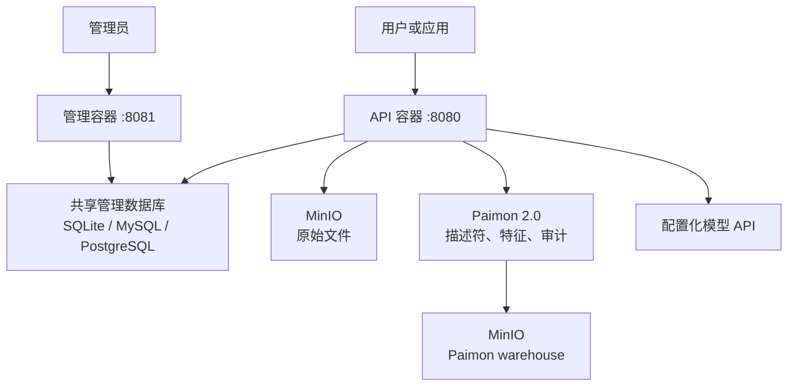

# MorphLake

MorphLake 是一个以 **Apache Paimon 2.0 + MinIO** 为核心的多模态数据底座。它用一个
Python/FastAPI API 容器提供上传、清单查询、全文检索、向量检索和下载接口，独立管理容器
提供 Key、配额、统计和监控页面；不引入 Spark、
Milvus、Elasticsearch，也不依赖常驻 Flink 作业。

> 当前状态：可运行的首个版本。生产部署前需要接入实际 MinIO 地址和模型网关，并根据
> 数据量完成压测与备份策略验证。

## 设计目标

- **简单**：同一 Python 镜像分别启动 API 与管理容器，不新增检索或任务队列组件。
- **稳定**：六张固定粒度的追加型 Paimon 表、事务型管理数据库原子限流；不维护常驻计算作业。
- **Descriptor‑Only**：文件二进制只存 MinIO；Paimon 保存对象引用、元数据、文本和向量。
- **原生检索**：全文使用 Paimon `full-text`，向量默认使用 Paimon `ivf-sq` 全局索引。
- **配置驱动模型**：模型提供方、地址、模型名、维度、超时均在 YAML/环境变量中配置。



## 能力范围

| 能力 | 支持内容 |
| --- | --- |
| 上传 | 文档、图片、音频独立接口；全部生成文本摘要，图片额外生成缩略图 |
| 归属元数据 | 上传时由 API Key 自动关联 `business_domain` 和 `department` |
| 文档处理 | 文本提取、可配置重叠切片、逐切片向量化 |
| 图片处理 | 视觉描述、文件级图片向量、MinIO JPEG 缩略图 |
| 音频处理 | 文件级音频向量；可选语音转写、内容摘要和转写文本向量 |
| 清单查询 | 普通 Key 按所属域查询；管理员可跨域按业务域、部门、文件名或概要筛选并分页 |
| 全文检索 | 日期范围、正文/切片/文件概要关键字；业务范围由 Key 自动限定 |
| 向量检索 | 上传文档/图片/音频自动向量化并返回 Paimon Top10；也支持直接提交向量 |
| 预览与下载 | 图片缩略图/放大、文本展示、音频播放，并可按 `file_id` 下载原文件 |
| 删除 | 单条或最多 200 条批量删除；Paimon 追加删除标记，MinIO 清理原文件和图片缩略图 |
| 访问控制 | 业务域 Key 仅查询本域，默认管理 Key 可查询全域；支持查看、复制和轮换 |
| 流量治理 | 按 Key 配置上传/下载周期次数及字节配额 |
| 运维 | 紧凑响应式 Web 管理台、数据库范围下拉、Prometheus 指标、Grafana 面板、天/周/月统计 |

旧式二进制 `.doc` 会返回 415；请先转换为 `.docx`。扫描版 PDF 的 OCR 不在默认链路中，
可通过模型网关扩展。

## 快速开始

### 1. 配置

```bash
cp .env.example .env
```

至少修改以下配置：

```dotenv
MINIO_ENDPOINT=minio.example.internal:9000
MINIO_ACCESS_KEY=replace-me
MINIO_SECRET_KEY=replace-me
MINIO_DATA_BUCKET=morphlake-data
MINIO_PAIMON_BUCKET=morphlake-paimon
PAIMON_WAREHOUSE=s3://morphlake-paimon/warehouse
```

管理数据库由 `config/database.yaml` 配置，默认使用 SQLite。跨主机扩展 API 时，将对应示例
复制为活动配置即可：

```bash
# MySQL 明文账号方式
cp config/database.mysql.native.yaml config/database.yaml

# PostgreSQL 加密账号方式
cp config/database.postgresql.encrypt.yaml config/database.yaml
```

| 数据库 | `native` | `encrypt` | 首次自动建库/表 |
| --- | --- | --- | --- |
| SQLite | 无需账号 | 不适用 | 自动创建文件和表 |
| MySQL | 配置内明文用户名、密码 | 配置内保存密文 | 支持 |
| PostgreSQL | 配置内明文用户名、密码 | 配置内保存密文 | 支持 |

使用加密方式时，密钥只放在环境变量，配置文件只保存 `ENC[...]` 密文：

```bash
export MORPHLAKE_DB_CREDENTIAL_KEY="$(python scripts/encrypt_db_credentials.py generate-key)"
python scripts/encrypt_db_credentials.py encrypt
```

把命令输出的 `auth` 段复制到 `config/database.yaml`，再把
`MORPHLAKE_DB_CREDENTIAL_KEY` 写入受保护的部署 Secret 或本机 `.env`。不要把密钥提交到 Git。

首次启动前还必须分别设置管理登录、会话、Key 摘要与 Key 可逆加密密钥；四项不要复用：

```bash
MORPHLAKE_ADMIN_PASSWORD=replace-with-a-strong-password
MORPHLAKE_ADMIN_SESSION_SECRET=replace-with-a-long-random-session-secret
MORPHLAKE_TOKEN_PEPPER=replace-with-a-long-random-token-pepper
MORPHLAKE_TOKEN_ENCRYPTION_SECRET=replace-with-a-separate-key-encryption-secret
```

管理数据库首次初始化会自动创建一个业务域/部门均为“管理员”的管理 Key。登录管理台后可在
“Key 管理”页面查看和复制；该 Key 拥有全域查询与下载权限，应按管理员凭据保护。

开发配置默认使用确定性的 `hash` 向量和抽取式摘要，仅用于接口和索引冒烟验证，不具备完整
语义效果。生产环境应修改 `config/models.yaml`，配置实际嵌入、摘要、视觉和语音转写模型；
嵌入模型可使用 `openai_compatible`，MacBook 本地摘要使用 Ollama `qwen2.5:7b`。

### MacBook + Ollama 本地测试

工程提供独立的 `config/models.ollama.yaml`、`.env.ollama.example` 和
`docker-compose.ollama.yml`，不会改变默认或生产模型配置。模型映射如下：

| 数据类型 | Ollama 链路 | 向量维度 |
| --- | --- | --- |
| 文档 | `qwen2.5:7b` 摘要，`nomic-embed-text:latest` 向量化 | 768 |
| 图片 | `minicpm-v:8b` 生成检索描述，再由 `nomic-embed-text:latest` 向量化 | 768 |
| 音频 | 本地测试使用确定性 hash；当前所列 Ollama 模型没有音频语义嵌入能力 | 384 |

你当前列出的模型已经包含本配置所需的两个模型。新机器可用以下命令下载或校验：

```bash
ollama pull nomic-embed-text:latest
ollama pull minicpm-v:8b
ollama pull qwen2.5:7b
ollama list
```

Ollama macOS 应用通常会自动启动服务；若没有运行，可执行：

```bash
ollama serve
```

先在 Mac 终端验证文本向量和视觉模型：

```bash
curl http://localhost:11434/v1/embeddings \
  -H 'Content-Type: application/json' \
  -d '{"model":"nomic-embed-text:latest","input":"多模态数据底座测试"}'

IMAGE_BASE64=$(base64 < ./test.png | tr -d '\n')
curl http://localhost:11434/api/chat \
  -H 'Content-Type: application/json' \
  -d '{
    "model":"minicpm-v:8b",
    "messages":[{
      "role":"user",
      "content":"请描述图片中的对象和文字",
      "images":["'"$IMAGE_BASE64"'"]
    }],
    "stream":false
  }'
```

启动 MorphLake 前复制本地配置，并填写可访问的 MinIO 地址和凭据：

```bash
cp .env.ollama.example .env.ollama
docker compose -f docker-compose.ollama.yml up --build -d
curl http://localhost:8080/health/live
```

容器通过 Docker Desktop 的 `host.docker.internal:11434` 访问 Mac 上的 Ollama。本配置使用
一套带 `_ollama` 后缀的六张 Paimon 表，避免与默认 384/512 维索引混用。不要在已有 Paimon
向量表上直接修改维度。

### 2. 启动 API 与独立管理容器

```bash
docker compose up --build -d
curl http://localhost:8080/health/live
curl http://localhost:8081/health/live
```

直接访问 `http://localhost:8081` 即会跳转登录界面，使用 `.env` 中的管理账号登录，创建绑定业务域和部门的
Key。首次启动会自动创建业务域/部门均为“管理员”的全域管理 Key。登录后是窄头部、左侧菜单、右侧工作区的响应式管理台；文件上传、文件清单、全文检索、
向量检索、文件下载和 API 状态均可直接在页面操作。桌面端表单采用紧凑横向布局，文件清单的
业务域和部门选项（含管理员范围）从管理数据库加载并联动筛选。每页条数位于清单底部，创建时间
按浏览器时区分两行显示；预览入口合并到预览框，下载入口合并到文件名，并支持复选框批量删除。
管理容器通过
`MORPHLAKE_API_BASE_URL=http://morphlake-api:8080` 转发到现有 API，不重复实现存储与检索逻辑。
Key 可在管理页面查看、复制或重新生成：

```bash
export MORPHLAKE_TOKEN='mlk_...'
curl http://localhost:8080/health/ready \
  -H "Authorization: Bearer $MORPHLAKE_TOKEN"
```

容器启动时会：

1. 根据配置创建管理数据库及六张管理表（含管理员会话表），并写入 schema 版本和默认配额配置；
2. 检查并创建两个 MinIO bucket（需要账号具有相应权限）；
3. 自动创建资产描述符、文本切片/概要、图片特征、音频特征、传输审计和删除标记六张 Paimon 表；
4. 校验已存在 Paimon 表的字段、分区、`bucket=-1` 和 deletion-vector；
5. 启动定时增量索引维护；上传请求本身不重建索引。

### 3. 上传并查询

```bash
curl -X POST http://localhost:8080/api/v1/files/documents \
  -H "Authorization: Bearer $MORPHLAKE_TOKEN" \
  -F 'file=@./contract.pdf'
```

用同模态查询文件自动向量化并查询 Top10（查询文件不会入库）：

```bash
curl -X POST http://localhost:8080/api/v1/search/vector/file \
  -H "Authorization: Bearer $MORPHLAKE_TOKEN" \
  -F 'start_date=2026-01-01' \
  -F 'end_date=2026-12-31' \
  -F 'file=@./query.pdf'
```

```bash
curl -G http://localhost:8080/api/v1/files \
  -H "Authorization: Bearer $MORPHLAKE_TOKEN" \
  --data-urlencode 'media_type=document' \
  --data-urlencode 'filename=contract' \
  --data-urlencode 'start_date=2026-01-01' \
  --data-urlencode 'end_date=2026-12-31'
```

管理员专属清单接口返回 `total`、`limit`、`offset` 和当前页数据；业务域、部门均可省略：

```bash
export MORPHLAKE_ADMIN_TOKEN='mlk_...'
curl -G http://localhost:8080/api/v1/admin/files \
  -H "Authorization: Bearer $MORPHLAKE_ADMIN_TOKEN" \
  --data-urlencode 'business_domain=risk' \
  --data-urlencode 'department=audit' \
  --data-urlencode 'filename=contract' \
  --data-urlencode 'description=counterparty exposure' \
  --data-urlencode 'limit=20' \
  --data-urlencode 'offset=0'
```

```bash
curl -X POST http://localhost:8080/api/v1/search/full-text \
  -H 'Content-Type: application/json' \
  -H "Authorization: Bearer $MORPHLAKE_TOKEN" \
  -d '{
    "keyword": "counterparty exposure",
    "start_date": "2026-01-01",
    "end_date": "2026-12-31",
    "limit": 20
  }'
```

向量请求中的维度必须与配置一致（默认文本 384、图片 512、音频 384）：

```bash
python - <<'PY' > /tmp/vector-request.json
import json
print(json.dumps({
    "vector_field": "text",
    "vector": [0.0] * 384,
    "start_date": "2026-01-01",
    "end_date": "2026-12-31",
    "limit": 10,
}))
PY

curl -X POST http://localhost:8080/api/v1/search/vector \
  -H 'Content-Type: application/json' \
  -H "Authorization: Bearer $MORPHLAKE_TOKEN" \
  --data-binary @/tmp/vector-request.json
```

```bash
curl -OJ \
  -H "Authorization: Bearer $MORPHLAKE_TOKEN" \
  http://localhost:8080/api/v1/files/FILE_ID/download
```

完整接口说明见 [docs/api.md](docs/api.md)，表结构见
[docs/table-model.md](docs/table-model.md)，架构和生产注意事项见
[docs/architecture.md](docs/architecture.md)，管理、限流和监控见
[docs/administration.md](docs/administration.md)。启动后可访问 API 容器 `/docs`，使用管理账号
HTTP Basic 认证后查看 OpenAPI UI。

## 海量数据分区与 unaware bucket

六表统一按 `ingest_date / domain_shard` 分区，并设置 `bucket=-1`。`domain_shard` 是业务域的
稳定哈希模 32；部门、业务域和媒体类型使用 Bitmap 索引，不按“部门 × 模态 × 日期”动态
分表。这样在每天 1 亿条、十年约 3650 亿条的规划下，表数量仍固定，日期裁剪与索引分片也
可独立维护。PyPaimon 2.0 的通用全文和向量全局索引要求 unaware bucket，固定桶会被拒绝。

通用全局索引同时要求关闭 deletion vectors，因此表采用追加模式。删除操作向
`multimodal_file_deletion` 追加 tombstone，所有清单、预览、下载、全文和向量结果均排除已删除
`file_id`，同时同步清理 MinIO 原文件和图片缩略图。该方式不重写每日大分区，也不破坏全文或
向量全局索引；后续可在维护窗口按删除标记执行物理清理。

## 开发验证

```bash
python -m venv .venv
. .venv/bin/activate
pip install -e '.[dev]'
ruff format --check src tests scripts
ruff check src tests scripts
pytest -q
```

带原生 Paimon 全文和向量索引的集成测试使用本地临时 warehouse，不连接真实 MinIO。
Docker 镜像构建也包含在 GitHub Actions 中。

## 目录

```text
config/                 模型、数据库和切片配置
docs/                   架构、表模型、接口文档
scripts/                数据库凭据加密工具
src/morphlake/api.py    固定 API 契约
src/morphlake/services  MinIO、模型、Paimon 和业务编排
tests/                  单元、接口和 PyPaimon 集成测试
```

## License

Apache-2.0
