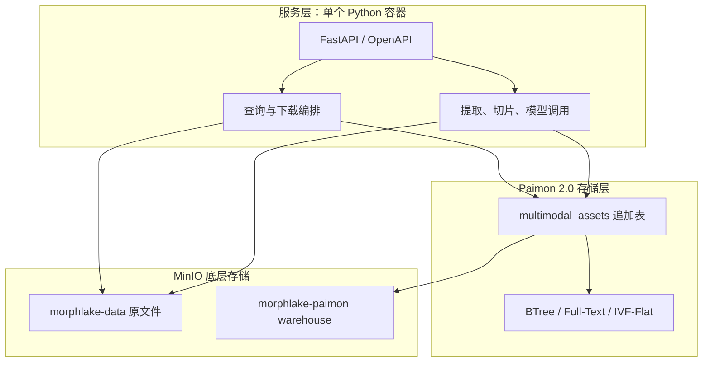
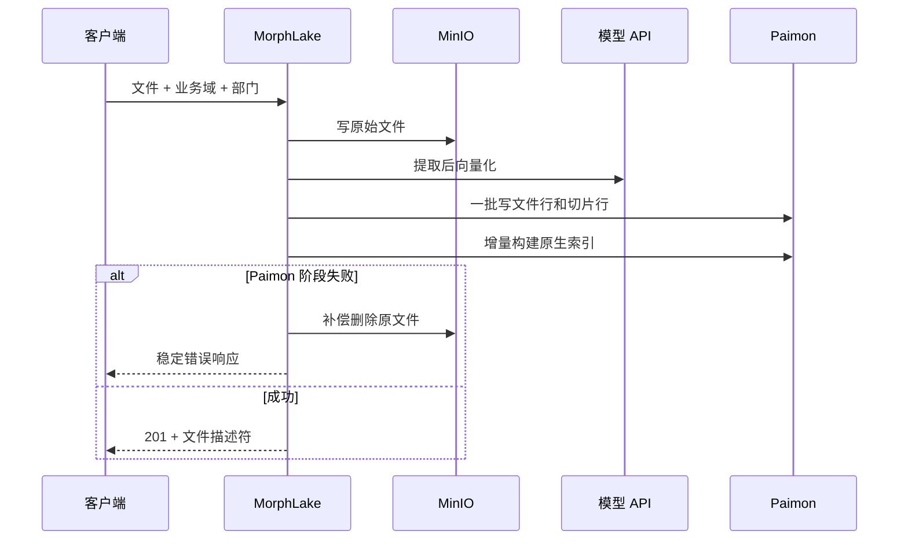

# 架构与运行说明

## 三层架构

服务容器直接使用 PyPaimon 批写 API 提交数据和增量构建全局索引。没有常驻 Flink 或 Spark
作业，也没有 Milvus、Elasticsearch 或任务队列。

## 上传时序与一致性

一个上传请求内，文件描述行和所有切片行在同一个 Paimon 批提交中完成。索引随后同步增量
构建。进程内写锁避免单容器内的并发提交冲突，因此容器固定为一个 worker。扩展到多个副本
前，应引入 Paimon 提交冲突重试和分布式写协调；这不属于首版简单部署范围。

## Descriptor‑Only

MinIO `morphlake-data` bucket 保存原始二进制；Paimon 只保存：

- `object_bucket`、`object_key`、`object_etag`、`file_size`；
- 文件业务元数据；
- 提取后的文本、切片位置；
- 模型向量。

因此 Paimon 表不会复制 Word、PDF、图片或音频二进制。

## 分区、桶与索引

| 项目 | 选择 | 原因 |
| --- | --- | --- |
| 分区 | 业务域 / 部门 / 上传月份 | 业务隔离和日期裁剪，避免日分区过碎 |
| 桶 | `-1`（unaware） | PyPaimon 2.0 通用全文/向量全局索引的约束 |
| 删除向量 | 关闭 | 通用全局索引的约束 |
| 写模式 | append-only | 避免更新/删除破坏索引约束 |
| 文件 ID | BTree 全局索引 | 下载和文件定位 |
| 文本 | Full-Text 全局索引 | 原生全文搜索 |
| 向量 | 每模态一个 IVF-Flat | 文本、图片、音频维度可独立配置 |

全文检索先以业务域和月份分区裁剪，再在读回结果时应用精确日期边界。向量检索将业务域和
日期谓词直接交给向量搜索构建器。

## 模型接入

`config/models.yaml` 定义四条路由：文本向量、图片向量、音频转写、音频向量。

- `hash`：开发/CI 使用的确定性向量，不具备真实语义能力；
- `openai_compatible`：调用 `/v1/embeddings`；
- 音频转写调用 `/v1/audio/transcriptions`；
- `none`：关闭音频转写。

YAML 支持 `${ENV_NAME:-default}` 插值。生产模型返回维度必须与 Paimon 环境变量一致，服务
会在启动和请求时校验。

## 生产清单

1. 给 MorphLake 使用专用 MinIO 账号，只授予两个 bucket 的必要权限。
2. 设置 `MORPHLAKE_API_KEY`，并在入口网关启用 TLS、限流和审计。
3. 把 YAML 中的 hash provider 替换为实际模型 API。
4. 固定一个容器副本/worker；扩容前先验证提交协调方案。
5. 对 MinIO 开启版本控制、生命周期和跨站备份，对 Paimon warehouse 做一致性备份。
6. 监控 `/health/ready`、请求延迟、模型错误、Paimon 提交失败和 MinIO 容量。
7. 用实际业务域/部门基数做分区和小文件压测；必要时设计离线 compact 维护窗口。
