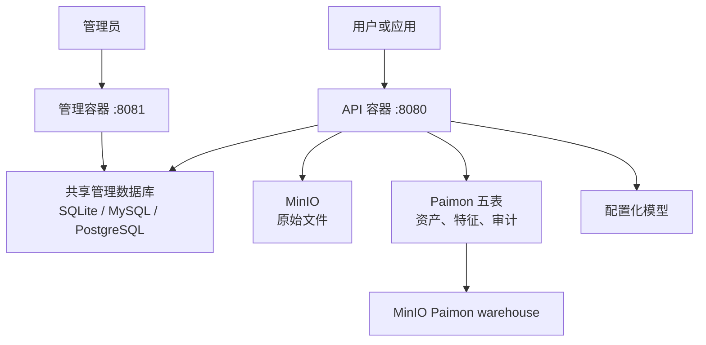
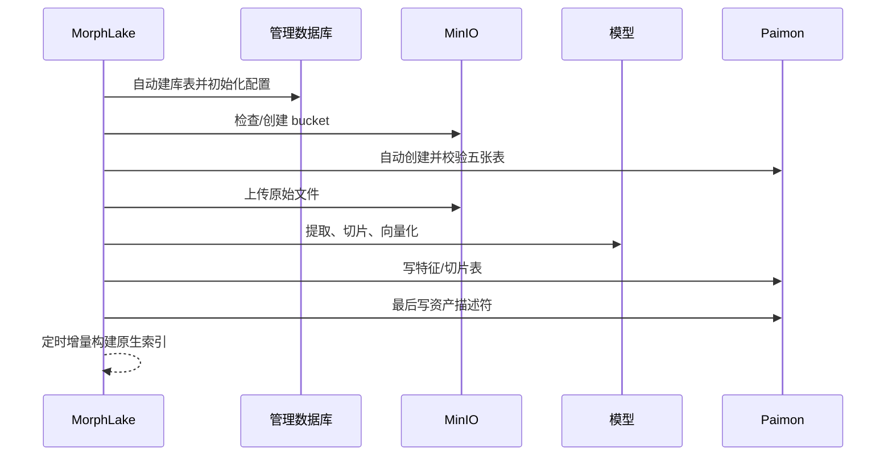

# 架构与运行说明

## 三层架构

工程不引入 Spark、Milvus、Elasticsearch 或任务队列。业务 API 与 Web 管理使用同一镜像、
两个独立容器，拥有独立端口、进程和健康检查，可独立重启。API 使用 PyPaimon 直接写入并
查询 Paimon 2.0；索引维护也是 API 容器内的轻量后台循环，不需要常驻 Flink 作业。

## 面向 100,000,000 条/日的模型

十年理论总量约 3650 亿条。工程不按“部门 × 类型 × 日期”组合创建物理表，否则表数量、
元数据和运维复杂度会随组织变化持续膨胀。固定使用五张不同粒度的表：资产描述符、文本
切片、图片特征、音频特征、传输审计。

五表统一按 `ingest_date / domain_shard` 分区，其中 `domain_shard` 是业务域 SHA-256 的稳定
哈希模 32。业务部门、业务域和媒体类型使用 Bitmap 索引，保留精确业务过滤能力而不形成
高基数目录。所有表使用 `bucket=-1`，由全局索引分片控制索引规模。

## 启动与上传时序

资产描述符是文件对外可见的提交标记。特征行先写，描述符最后写；全文和向量结果还会
回查描述符表。若多表写入在最后阶段失败，MinIO 对象会补偿删除，未发布的孤立特征不会
出现在检索结果中。Paimon 表之间没有跨表 ACID 事务，因此这是一种明确的可见性协议。

## Descriptor-Only

原始 Word、PDF、图片和音频二进制只保存到 `morphlake-data`。资产表只保存 bucket、object
key、ETag、大小、SHA-256 和业务元数据；Paimon warehouse 保存提取文本、固定维向量和
索引，不复制文件二进制。

## 索引维护

上传请求不再同步重建索引。服务启动后按 `PAIMON_INDEX_BUILD_INTERVAL_SECONDS` 定时调用
PyPaimon 增量索引构建，已索引 row range 会跳过。默认 300 秒，MacBook Ollama 测试配置为
30 秒。该设计降低请求延迟和高并发写入时的索引提交冲突。

| 表 | 原生索引 |
| --- | --- |
| 资产描述符 | file_id BTree；业务域/部门/类型 Bitmap |
| 文本切片 | file_id BTree；业务字段 Bitmap；content_text Full-Text；text_embedding IVF-SQ |
| 图片特征 | file_id BTree；业务字段 Bitmap；image_embedding IVF-SQ |
| 音频特征 | file_id BTree；业务字段 Bitmap；audio_embedding IVF-SQ |
| 传输审计 | event_id/token_id/file_id BTree；业务域/部门/操作/状态 Bitmap |

默认搜索模式为 `fast`，因此新写入数据会在下一次索引维护完成后进入全文/向量 TopK；清单
和下载不受此延迟影响。若本地测试需要更快可缩短间隔，生产环境应根据每批行数和索引耗时
调整，而不是每次上传构建。

## 生产注意事项

1. 以真实日写入量压测每日分区文件数、索引耗时和查询 P99，并调整分片数；既有表的分片
   算法与数量不能直接在线变更。
2. 单个 API 容器固定一个 worker；单机副本可共享 SQLite WAL，跨主机副本应统一连接 MySQL
   或 PostgreSQL。审计 outbox 使用行锁和租约避免重复消费，并应完善 Paimon 提交重试。
3. 为 MinIO 开启版本控制、容量告警、跨站备份和生命周期策略；十年保留应由合规策略确认。
4. 监控索引维护失败、最近成功时间、模型错误、Paimon 提交、MinIO 容量和小文件数量。
5. 规划离线 compact 与过期分区维护窗口；维护任务可按需使用短生命周期 Flink 作业，但不
   需要常驻作业。
